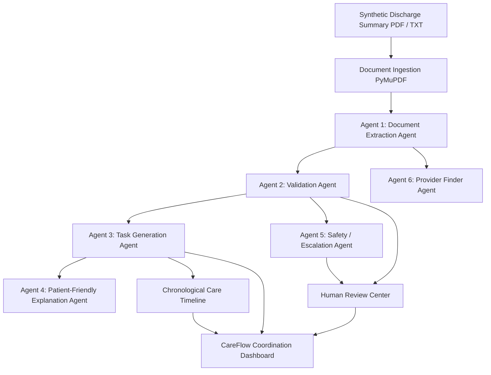

# CareFlow AI – Agentic Hospital Discharge & Follow-up Coordinator

> **Tagline:** Turn complex discharge instructions into a clear, trackable care plan.


---

## 1. Project Purpose & Core Architecture

**CareFlow AI** is an AI-powered post-hospital-discharge coordination platform. When a synthetic hospital discharge summary (in PDF or text format) is uploaded, the multi-agent system orchestrates extraction, validation, task generation, plain-English translation, and safety guardrail checks to create an actionable care plan.

### Core Value Proposition
$$\text{Upload} \longrightarrow \text{Understand} \longrightarrow \text{Organize} \longrightarrow \text{Track} \longrightarrow \text{Review}$$

---

## 2. Multi-Agent Orchestration Architecture

Unlike generic chatbots, CareFlow AI coordinates 6 specialized autonomous subagents:



### The 6 Agents:
1. **Agent 1 – Document Extraction Agent**
   - Extracts discharge dates, appointments, tests, referrals, medications (*exact instructions preserved verbatim*), care/wound instructions, and red flag warning signs.
   - Attaches strict source references (e.g. `Discharge Summary - Page 2 - Follow-up section`).
2. **Agent 2 – Validation Agent**
   - Detects missing dates, ambiguous instructions (*"as needed"*, *"sometime next week"*), missing medication duration, or conflicting dates.
   - **Never fabricates missing dates or instructions**; flags items for Human Review.
3. **Agent 3 – Task Generation Agent**
   - Converts clinical orders into prioritized, trackable tasks (`Pending`, `Completed`, `Needs Review`) across Medication, Appointment, Test, Care, and Referral categories.
4. **Agent 4 – Patient-Friendly Explanation Agent**
   - Rewrites complex medical terminology into accessible, plain English without modifying clinical meaning or adding unauthorized advice.
5. **Agent 5 – Safety / Escalation Agent**
   - Evaluates patient queries and clinical documents against strict healthcare boundaries (stopping/starting medications, dose modifications, acute symptoms).
   - Enforces the **"Human Review Required"** boundary and blocks automated clinical answers.
6. **Agent 6 – Provider Finder Agent**
   - Matches specialty follow-up requirements against synthetic provider directories.
   - Adds mandatory disclaimer: *"Provider matches are based on synthetic data and do not guarantee availability, suitability, or clinical appropriateness."*

---

## 3. Strict Healthcare Safety Boundaries

CareFlow AI is an administrative coordination system, **NOT** a diagnostic or treatment system.

### The AI NEVER:
- ❌ Diagnoses diseases or conditions
- ❌ Recommends or initiates medical treatments
- ❌ Modifies medication dosages
- ❌ Tells a patient to stop or start a medication
- ❌ Invents missing instructions or fabricated dates
- ❌ Gives personalized medical advice
- ❌ Presents synthetic provider matches as guaranteed

---

## 4. Built-in Synthetic Scenarios

The system includes 5 built-in synthetic scenarios accessible with a single click on the **Upload** page:

1. **Scenario 1 – Normal Discharge:**
   - Standard post-stent recovery with cardiology follow-up, blood tests, and clear medication schedules.
2. **Scenario 2 – Multiple Follow-ups & Referrals:**
   - Complex multi-specialty care requiring Cardiology, Endocrinology, and Nephrology referrals.
3. **Scenario 3 – Ambiguous Instructions:**
   - Missing follow-up dates and undefined medication durations automatically flagged as **Needs Review**.
4. **Scenario 4 – Conflicting Instructions:**
   - Detects contradictory timelines (2-week staple removal order vs. 6-week attending addendum).
5. **Scenario 5 – Clinically Sensitive Query:**
   - A patient inquiry regarding forearm bruising and stopping blood thinners triggers Agent 5's safety guardrail for immediate clinical escalation.

---

## 5. Technology Stack

### Frontend
- **React 19** + **Vite 8**
- **Tailwind CSS v4** (Modern Healthcare SaaS design palette: `#f8fafc` canvas, `#0284c7` sky accents, `#0d9488` teal)
- **Lucide React** icons
- **React Router v7**
- **Axios**

### Backend
- **Python 3.14**
- **FastAPI** + **Uvicorn**
- **Pydantic v2**
- **PyMuPDF (`pymupdf`)** for PDF text extraction

---

## 6. How to Run Locally

### Start Backend
```powershell
# From the project root
python -m uvicorn backend.main:app --host 127.0.0.1 --port 8000 --reload
```
API Documentation available at: [http://127.0.0.1:8000/docs](http://127.0.0.1:8000/docs)

### Start Frontend
```powershell
# In a new terminal
cd frontend
npm run dev -- --host 127.0.0.1 --port 5173
```
Open web application at: [http://127.0.0.1:5173](http://127.0.0.1:5173)

---

## 7. Responsible AI Governance
All synthetic datasets adhere to responsible AI principles:
- Transparent audit trail on **AI Activity** page.
- Explainable citations with **View Source** buttons on all extracted instructions.
- Human-in-the-loop clinical review center for all ambiguous entities.
